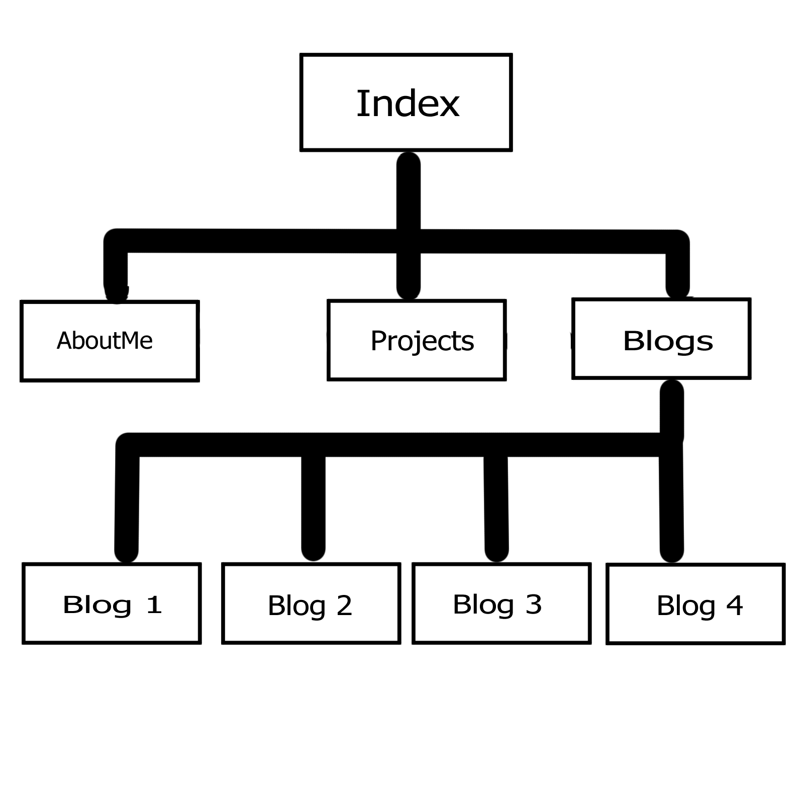

# Portfolio Documentation

## [Website for Portfolio](https://calm-conkies-04ace2.netlify.app/index.html) 

## [Github Repository](https://github.com/doigiee/JoshuaDoig_T1A2)

### Purpose 
The portfolio I created demonstrates the content which I have been learning throughout weeks 1-3. It impliments a easily navigatable nav system and has a simple but effective interface and design. I've also imbedded many useful links which showcase to IT recruiters my progress throughout this coding journey, with the goal of being able to act as a resume to employers. I hope to continually update this repo as my journey continues, hopefully in future I'll be able to insert my projects and thus attract recruiters. 

### Functionality and features
My portfolio contains numerous pages filled with navigatable features and design. The home and about me pages serves as the focal point which connect to my blog, projects and resume pages and changes appearance with the hover function. I've also made the website and all linking pages resposive to thus make my portfolio useable for pc, phone and laptop users and achieved this through the mobile first approach.

### Sitemap
 
https://github.com/doigiee/JoshuaDoig_T1A2/blob/main/Sitemap/Sitemap.jpg
