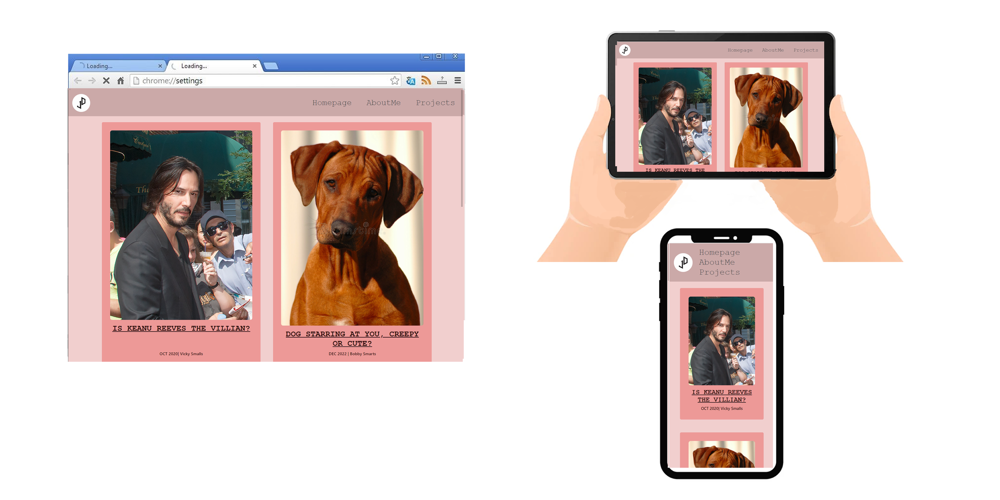

# Portfolio Documentation

## [Website for Portfolio](https://calm-conkies-04ace2.netlify.app/index.html) 

## [Github Repository](https://github.com/doigiee/JoshuaDoig_T1A2)

## Purpose 
The portfolio I created demonstrates the content which I have been learning throughout weeks 1-3. It impliments a easily navigatable nav system and has a simple but effective interface and design. I've also imbedded many useful links which showcase to IT recruiters my progress throughout this coding journey, with the goal of being able to act as a resume to employers. I hope to continually update this repo as my journey continues, hopefully in future I'll be able to insert my projects and thus attract recruiters. 

## Functionality and features
My portfolio contains numerous pages filled with navigatable features and design. The home and about me pages serves as the focal point which connect to my blog, projects and resume pages and changes appearance with the hover function. I've also made the website and all linking pages resposive to thus make my portfolio useable for pc, phone and laptop users and achieved this through the mobile first approach.

## Technology Used
- Vistual Studio Code- for coding w/ HTML5 and CSS3
- Google Chrome- general search and display serach engine
- CLIP STUIO PAINT - editing images and creating screenshots/wireframe
- GITHUB - publishing repositories
- Netlify - publishing site

## Info: Home page
The hompage serves as the hub for this portolio, connecting all main pages.

## Info: About me 
This page serves to showcase my personality and to catch the eyes of viewers.

## Info: Projects
This is a page dedicated to show the recent projects i've been working on.

## Info: Blogs
Blogs was created to provide recruiters a place to connect with me and other interested developers.

## Info: Resume
Resume is a direct link to my education and work history.

## Info: Sitemap and Wireframes
Sitemap displays a general overview of my portfolio and a way to navigate by seeing how it's all connected and Wiredframes are useful as they show you the viewer how my Portfolio displays on different devices.

## Sitemap
Created in CLIP STUDIO
 

## Wireframes
Created in CLIP STUDIO
### Homepage

### AboutMe page

### Projects page

### Blogs page

### Blogs content

